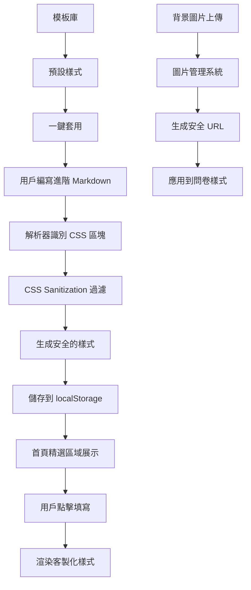

# QTER 問卷表單管理系統 - 進階客製化功能開發計劃

**專案狀態**：Phase 4 進階功能擴展
**技術棧**：Vue 3 + TypeScript + Tailwind CSS + Vite
**新增目標**：支援 HTML/CSS 自訂樣式的進階客製化問卷

## 🎯 專案願景

QTER 將從輕量化問卷工具進化為支援完全客製化的問卷平台，讓用戶能夠：
- 使用 Markdown + HTML/CSS 創建視覺豐富的問卷
- 自訂字體、顏色、背景圖片等視覺元素
- 在首頁展示精美的客製化問卷
- 保持原有的簡潔操作體驗

## 🚀 核心功能進展

### 已完成模組（Phase 1-3）
- ✅ **後端 API（100% 完成）**
  - 認證系統（JWT + Refresh Token）
  - 表單管理 CRUD
  - 題目管理系統
  - 回應收集與統計
  - 檔案上傳（MinIO）
  - 資料匯出（CSV/Excel）

- ✅ **前端基礎架構（100% 完成）**
  - Vue 3 + TypeScript 設置
  - Tailwind CSS 配置
  - 路由架構
  - API 服務層

- ✅ **核心問卷功能（90% 完成）**
  - Dashboard（表單列表）
  - FormEditor（雙向編輯器：視覺 ↔ Markdown）
  - FormFill（填寫頁面：單題模式 + 全頁模式）
  - FormResponses（回應列表）
  - FormAnalytics（統計頁面）
  - 8種題型支援
  - 拖拽排序功能

## 🔥 新功能：進階客製化問卷

### 核心特色
1. **進階 Markdown 語法**
   - 支援內嵌 CSS 樣式區塊
   - 背景圖片語法支援
   - 字體和顏色自訂設定
   - HTML 標籤與 Markdown 混合

2. **安全機制**
   - 完整 HTML/CSS 支援
   - Content Security Policy 防護
   - CSS Sanitization 過濾機制
   - XSS 攻擊防範

3. **首頁精選展示**
   - 新增「精選問卷」區域
   - 客製化樣式卡片展示
   - 直接點擊填寫，無需額外導航

4. **模板庫系統**
   - 預設樣式模板
   - 一鍵套用設計
   - 範例問卷展示

## 🏗️ 技術架構設計

### 進階 Markdown 語法規範

```markdown
---
title: 客製化問卷標題
description: 問卷描述
background: url('./bg-image.jpg')
theme: custom
---

<style>
.question-container {
  background: linear-gradient(135deg, #667eea 0%, #764ba2 100%);
  color: white;
  padding: 20px;
  border-radius: 10px;
}

.title {
  font-family: 'Noto Sans TC', sans-serif;
  font-size: 24px;
  text-shadow: 2px 2px 4px rgba(0,0,0,0.3);
}

.option {
  background: rgba(255,255,255,0.1);
  backdrop-filter: blur(10px);
  border: 1px solid rgba(255,255,255,0.2);
}
</style>

## 問題標題
type: radio
required: true
style: question-container
options:
  - 選項一
  - 選項二
```

### 安全機制架構

```typescript
// CSS Sanitization 層級
interface SecurityConfig {
  allowedTags: string[]           // 允許的 HTML 標籤
  allowedAttributes: string[]     // 允許的屬性
  allowedCssProperties: string[]  // 允許的 CSS 屬性
  forbiddenPatterns: RegExp[]     // 禁用的危險模式
}

// Content Security Policy
const cspConfig = {
  'style-src': "'self' 'unsafe-inline'",
  'img-src': "'self' data: blob:",
  'script-src': "'self'",
  'object-src': "'none'"
}
```

### 系統流程圖



## 📋 實作 TODO 清單

### Phase 4.1: 基礎架構（1週）
- [ ] **擴展型別定義** - 在 `frontend/src/types/index.ts` 新增客製化問卷相關型別
- [ ] **設計進階 Markdown 語法規範** - 支援 CSS 樣式區塊和背景圖片語法
- [ ] **實作 CSS sanitization 函數** - 建立安全的 HTML/CSS 過濾機制
- [ ] **實作 Content Security Policy** - 配置前端安全策略防範 XSS

### Phase 4.2: 核心功能（2週）
- [ ] **擴展 Markdown 解析器** - 修改 `EditorView.vue` 支援內嵌 CSS 和 HTML
- [ ] **設計進階樣式預覽功能** - Markdown 編輯器即時預覽自訂樣式
- [ ] **實作背景圖片管理功能** - 支援圖片上傳、預覽和 URL 管理
- [ ] **建立客製化問卷模板庫** - 設計預設樣式模板系統

### Phase 4.3: 前端整合（1週）
- [ ] **修改首頁 HomeView.vue** - 新增精選問卷展示區域
- [ ] **更新填寫頁面渲染引擎** - `FillView/AllAtOnceView` 支援自訂樣式
- [ ] **建立範例客製化問卷** - 展示各種樣式效果的示範問卷

### Phase 4.4: 測試與文檔（3天）
- [ ] **建立安全性測試套件** - 測試各種攻擊向量和邊界情況
- [ ] **撰寫使用者指南** - 包含語法說明、範例模板和最佳實踐
- [ ] **更新專案文檔** - 同步更新 `README.md` 和相關技術文檔

## 🔒 安全性考量

### 防護策略
1. **輸入驗證**
   - CSS 屬性白名單過濾
   - 危險函數檢測（如 `javascript:`、`data:` 等）
   - HTML 標籤和屬性限制

2. **內容安全策略**
   - 嚴格的 CSP 頭部設定
   - 禁用內聯腳本執行
   - 限制外部資源載入

3. **運行時保護**
   - DOM 操作前再次驗證
   - 動態樣式注入監控
   - 異常行為檢測

### 測試覆蓋
- XSS 注入測試
- CSS 注入攻擊
- 圖片上傳安全測試
- CSP 繞過嘗試

## 🎨 視覺設計規範

### 模板類別
1. **商務風格** - 簡潔專業的企業問卷
2. **創意風格** - 漸層色彩的現代設計
3. **學術風格** - 清晰易讀的研究問卷
4. **活動風格** - 活潑有趣的互動問卷

### 設計原則
- 響應式設計優先
- 無障礙訪問支援
- 載入效能最佳化
- 跨瀏覽器相容性

## 📈 預期效益

### 用戶價值
- **創作自由度** ↑ 300% - 完全自訂的視覺設計
- **問卷吸引力** ↑ 200% - 美觀的視覺呈現提升填寫率
- **品牌一致性** ↑ 150% - 與企業 CI 完美整合

### 技術價值
- 建立可擴展的樣式系統
- 強化安全防護機制
- 提升平台競爭力

## 🚦 風險管控

### 技術風險
- **CSS 相容性** - 透過 autoprefixer 解決
- **效能影響** - 實作樣式快取機制
- **安全漏洞** - 多層驗證 + 定期安全審計

### 操作風險
- **學習曲線** - 提供詳細的使用指南
- **模板品質** - 建立設計審核機制
- **維護成本** - 自動化測試覆蓋

## 🎯 成功指標

### 量化指標
- 客製化問卷使用率 > 40%
- 問卷填寫完成率提升 > 25%
- 安全事件 = 0
- 載入效能 < 3s

### 質化指標
- 用戶回饋積極度
- 設計師接受度
- 開發者維護滿意度

---

**下一步行動：** 開始 Phase 4.1 基礎架構建設，重點實作型別定義和安全機制。