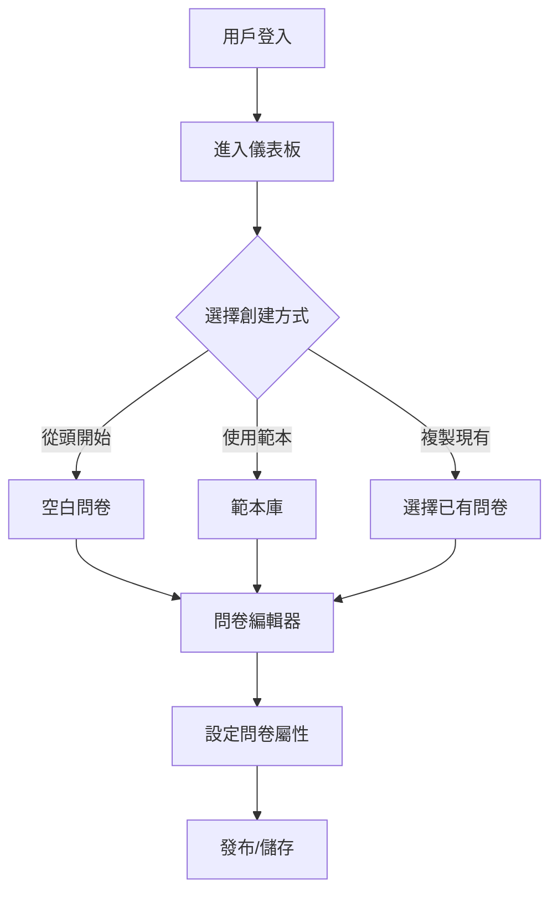
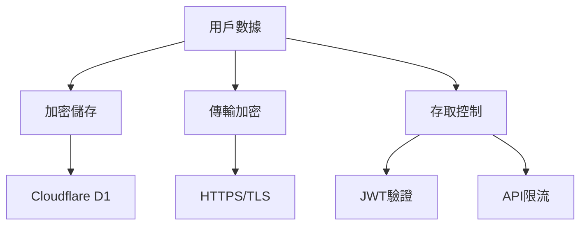
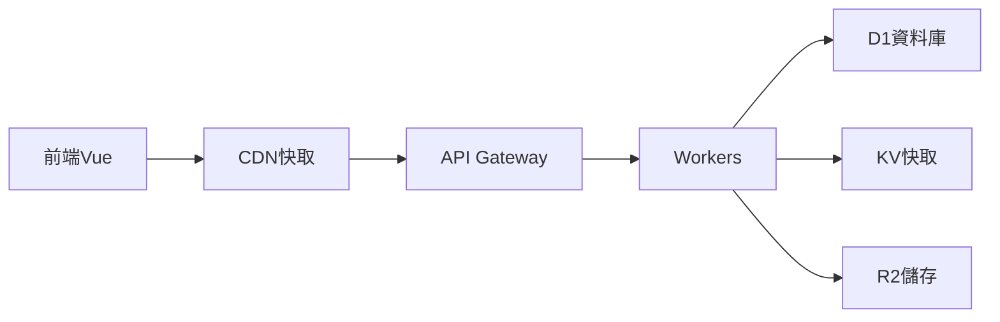

# 📋 Qter 智能問卷平台 - 產品需求文檔 v3.0

## 🎯 產品定位
面向大眾的智能問卷平台，讓每個人都能輕鬆創建、分享和分析問卷，打造個人專屬的問卷庫。

## ✅ 已完成功能
- ✓ Google OAuth 2.0 登入系統
- ✓ 用戶認證與 JWT Token 管理
- ✓ 登入頁面與儀表板介面
- ✓ TypeScript 類型安全實作
- ✓ Vercel 部署流程

## 🚀 待開發功能規劃

### 1. 用戶問卷管理系統

#### 1.1 問卷創建流程


#### 1.2 問卷權限管理
- **私有問卷**：僅創建者可見
- **公開問卷**：任何人可填寫
- **限制問卷**：需要密碼或邀請碼
- **時效問卷**：設定開放時間

#### 1.3 多用戶考量
| 功能 | 描述 | 優先級 |
|------|------|--------|
| 用戶配額 | 每個用戶最多創建 50 份問卷（免費版） | P0 |
| 回覆限制 | 每份問卷最多 1000 份回覆（免費版） | P0 |
| 儲存空間 | 每個用戶 100MB 附件空間 | P1 |
| 並發控制 | 防止同時編輯衝突 | P0 |
| 版本控制 | 自動儲存編輯歷史 | P1 |

### 2. 問卷範本系統

#### 2.1 預設範本庫
```yaml
教育類:
  - 課程回饋調查
  - 學習成效評估
  - 教學滿意度調查
  
商業類:
  - 客戶滿意度調查
  - 市場調研問卷
  - 員工滿意度調查
  - 產品回饋表單
  
活動類:
  - 活動報名表
  - 活動滿意度調查
  - 餐飲偏好調查
  
個人類:
  - 婚禮出席調查
  - 聚會安排調查
  - 旅遊規劃問卷
```

#### 2.2 範本管理功能
- **儲存為範本**：將自己的問卷儲存為個人範本
- **範本分享**：將範本分享給其他用戶（未來功能）
- **範本市場**：瀏覽和使用社群範本（未來功能）

### 3. 數據安全與隱私

#### 3.1 資料保護機制


#### 3.2 隱私設計原則
- **資料最小化**：只收集必要資料
- **透明化**：清楚說明資料用途
- **用戶控制**：提供資料下載與刪除選項
- **匿名填寫**：支援匿名回覆模式
- **IP保護**：不記錄填寫者IP（可選）

### 4. 回覆管理系統

#### 4.1 防濫用機制
| 機制 | 說明 | 實作方式 |
|------|------|----------|
| 重複提交防護 | 防止同一用戶重複填寫 | Cookie/LocalStorage |
| 驗證碼 | 高風險操作需要驗證 | Google reCAPTCHA |
| IP限流 | 同IP短時間內限制提交次數 | Cloudflare Rate Limiting |
| 惡意內容過濾 | 自動過濾垃圾內容 | 關鍵詞過濾 |

#### 4.2 回覆通知系統
- **即時通知**：新回覆即時顯示（WebSocket）
- **批量通知**：定時彙整通知（每日/每週）
- **閾值通知**：達到特定回覆數量通知
- **異常通知**：偵測異常回覆模式

### 5. 分析與報表功能

#### 5.1 即時分析儀表板
```yaml
基礎統計:
  - 總回覆數
  - 平均完成時間
  - 完成率
  - 跳出率

圖表類型:
  - 圓餅圖（單選題）
  - 長條圖（多選題）
  - 文字雲（開放題）
  - 趨勢圖（時間序列）

進階分析:
  - 交叉分析
  - 分群分析
  - 情感分析（文字題）
```

#### 5.2 匯出功能
- **格式支援**：CSV, Excel, PDF
- **自訂欄位**：選擇要匯出的題目
- **篩選條件**：按時間/答案篩選
- **排程匯出**：定期自動匯出（付費功能）

### 6. 團隊協作功能（未來擴充）

#### 6.1 協作模式
- **共同編輯**：多人同時編輯問卷
- **權限分級**：擁有者/編輯者/檢視者
- **評論系統**：題目討論與註解
- **審核流程**：發布前審核機制

#### 6.2 組織管理
- **團隊空間**：獨立的團隊工作區
- **成員管理**：邀請/移除成員
- **資料共享**：團隊問卷庫
- **統一帳單**：團隊付費方案

### 7. 效能與擴展性設計

#### 7.1 系統架構優化


#### 7.2 效能指標
- **首頁載入**：< 1.5秒
- **API響應**：< 100ms
- **問卷載入**：< 2秒
- **並發用戶**：支援 5000+ 同時在線
- **月活用戶**：支援 100,000+ MAU

### 8. 商業模式規劃

#### 8.1 免費版 vs 付費版
| 功能 | 免費版 | 專業版 | 企業版 |
|------|--------|--------|--------|
| 問卷數量 | 10份 | 無限制 | 無限制 |
| 每月回覆數 | 100 | 10,000 | 無限制 |
| 問題數/問卷 | 10題 | 無限制 | 無限制 |
| 資料匯出 | CSV | 所有格式 | 所有格式+API |
| 自訂主題 | 基礎 | 進階 | 完全自訂 |
| 團隊協作 | ❌ | 5人 | 無限制 |
| 價格 | 免費 | $9.99/月 | $49.99/月 |

#### 8.2 增值服務
- **品牌客製化**：移除 Qter 品牌標誌
- **API 存取**：程式化存取問卷資料
- **優先支援**：24小時內回覆
- **資料備份**：每日自動備份
- **SLA保證**：99.9% 可用性保證

## 🎯 2025 Q1 開發路線圖

### 第一階段：核心功能完善（1月）
- [x] Google 登入系統
- [ ] 用戶儀表板完善
- [ ] 問卷 CRUD 完整實作
- [ ] 基礎權限控制

### 第二階段：分享與收集（2月）
- [ ] 短網址系統
- [ ] QR Code 生成
- [ ] 匿名填寫模式
- [ ] 基礎防濫用機制

### 第三階段：數據與分析（3月）
- [ ] 即時統計圖表
- [ ] CSV/Excel 匯出
- [ ] 基礎篩選功能
- [ ] 響應式報表

### 第四階段：優化與擴充（Q2）
- [ ] 範本系統
- [ ] 進階分析
- [ ] 團隊協作
- [ ] 付費方案

## 📊 成功指標（KPI）

### 用戶增長
- **月活躍用戶**：Q1 達到 1,000 MAU
- **註冊轉換率**：訪客轉註冊 > 25%
- **留存率**：7日留存 > 40%

### 使用指標
- **問卷創建數**：每月 > 5,000 份
- **回覆完成率**：> 75%
- **平均使用時長**：> 15分鐘/次

### 技術指標
- **系統可用性**：> 99.5%
- **錯誤率**：< 0.1%
- **性能分數**：Lighthouse > 90

## 🔒 合規性要求

### 法規遵循
- **GDPR**：歐盟資料保護
- **CCPA**：加州隱私法
- **個資法**：台灣個人資料保護法

### 安全認證（未來）
- ISO 27001 資訊安全管理
- SOC 2 Type II 認證
- SSL/TLS 加密傳輸

## 📝 注意事項

### 開發原則
1. **用戶優先**：所有功能以用戶體驗為中心
2. **漸進增強**：從 MVP 逐步擴充功能
3. **資料安全**：隱私保護是最高優先級
4. **效能優化**：確保快速響應
5. **無障礙設計**：支援 WCAG 2.1 AA 標準

### 風險管理
- **技術風險**：採用成熟技術棧降低風險
- **安全風險**：定期安全審計與更新
- **法律風險**：確保合規性文件完整
- **市場風險**：快速迭代回應用戶需求

---

*最後更新：2025-09-30*
*版本：3.0 - 多用戶平台規劃*