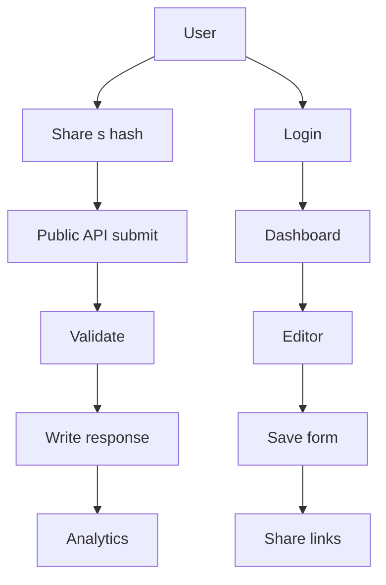
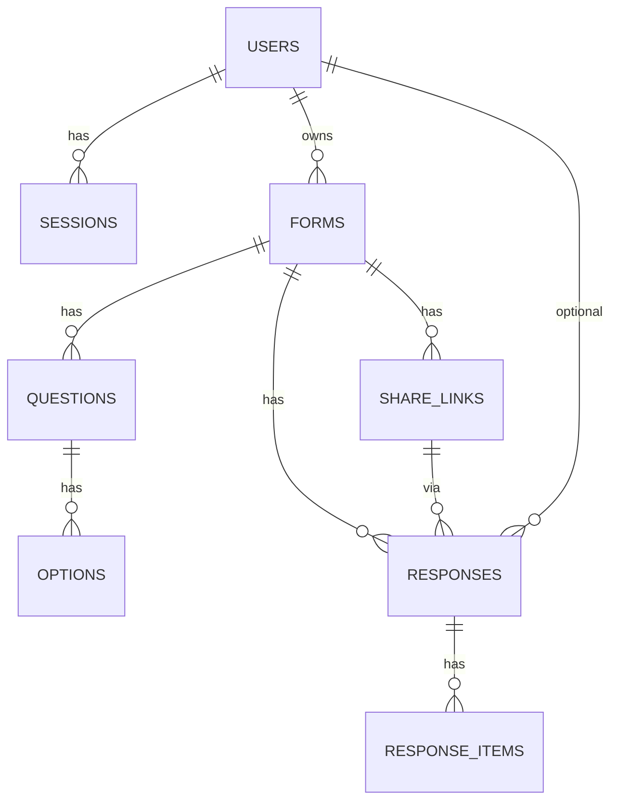

# 📋 輕巧問卷系統 - 產品需求文檔

## 🎯 產品願景
打造一個**所見即所得**的輕量化問卷工具，讓表單設計變得像聊天一樣簡單自然。

## 👥 目標用戶

### 內容創作者
- 部落客、YouTuber 需要收集讀者意見
- 活動主辦方需要收集報名資訊
- 小型企業需要客戶回饋

### 一般用戶
- 想要輕鬆填寫問卷的人
- 對複雜工具感到厭煩的使用者
- 重視美觀和易用性的用戶

## ✨ 核心需求

### 1. 所見即所得編輯體驗
- **即時預覽**：編輯時就能看到最終效果
- **拖拽操作**：視覺化調整題目順序
- **直觀介面**：像在編輯文檔一樣簡單

### 2. 現代化視覺設計
- **卡片佈局**：清爽的卡片式設計
- **柔和色彩**：舒適的色彩搭配
- **響應式**：完美適配手機和桌面
- **流暢動畫**：增強互動體驗

### 3. 輕量化架構
- **零依賴運行**：前端獨立運行
- **本地儲存**：資料永不遺失
- **快速載入**：瞬間啟動應用
- **靜態部署**：隨處可部署

## 🎯 具體功能需求

### 📝 題型支援
- **短答題**：單行文字輸入
- **長答題**：多行文字輸入
- **單選題**：圓形按鈕選擇
- **多選題**：方形複選框
- **圖片上傳**：支援預覽和刪除
- **分隔線**：視覺分組

### 🔧 編輯功能
- 新增題目（點擊按鈕）
- 刪除題目（滑鼠右鍵）
- 拖拽排序（拖拽手柄）
- 即時編輯（點擊編輯）
- 複製題目（快捷鍵支援）

### 📱 填寫體驗
- **手機優先**：觸控友善設計
- **鍵盤支援**：完整鍵盤操作
- **自動儲存**：填寫過程不遺失
- **驗證提示**：友善的錯誤提示
- **進度指示**：清楚的填寫進度

### 📊 資料管理
- **即時儲存**：LocalStorage 本地儲存
- **匯出功能**：CSV/JSON 格式匯出
- **統計查看**：簡單的回應統計
- **資料清理**：一鍵清空所有資料

## 🏗️ 技術實現需求

### 前端技術棧
- **Vue 3** + Composition API
- **TypeScript** 類型安全
- **Tailwind CSS** 實用優先樣式
- **Vite** 現代化建構工具

### 架構設計
- **元件化**：可複用的小型元件
- **狀態管理**：輕量化的狀態管理
- **路由設計**：簡單的頁面切換
- **資料流**：清晰的資料流設計

## 📈 成功指標

### 使用者體驗指標
- **載入時間**：< 2秒
- **互動響應**：< 100ms
- **操作完成率**：> 95%
- **用戶滿意度**：> 4.5/5

### 技術指標
- **打包大小**：< 500KB
- **Lighthouse 評分**：> 90
- **跨瀏覽器支援**：現代瀏覽器全支援
- **行動裝置相容**：iOS/Android 全支援

## 🚀 交付計劃

### 第一階段：基礎架構 (1-2 天)
- 專案初始化
- 基礎佈局搭建
- 資料儲存系統

### 第二階段：核心編輯器 (2-3 天)
- 題目編輯功能
- 即時預覽系統
- 拖拽排序功能

### 第三階段：填寫體驗 (2-3 天)
- 表單填寫介面
- 資料驗證系統
- 行動裝置優化

### 第四階段：完善優化 (1-2 天)
- 動畫效果優化
- 資料匯出功能
- 最終測試部署

## 🎨 設計原則

### 簡潔至上
- 移除所有不必要的元素
- 專注於核心功能體驗
- 讓操作變得直觀自然

### 一致性
- 統一的視覺語言
- 一致的互動模式
- 一致的資料處理方式

### 包容性
- 支援不同裝置和瀏覽器
- 考慮不同使用者的需求
- 提供無障礙的使用體驗
<!-- SaaS 與資料庫規劃補充：放在文件末端 -->

---

## 🗄️ SaaS 與資料庫規劃提案

目標
- 支援註冊登入與多人使用
- 問卷可透過短哈希連結分享與收集
- 後端持久化儲存，取代僅 localStorage 的限制
- 保留現有前端體驗與進階 Markdown 能力

### 1) 帳號與身份

- Auth 模式
  - Email 密碼登入
  - JWT Access Token + Refresh Token
  - 密碼重設、Email 驗證
- 角色與權限
  - owner 可管理表單與成員
  - editor 可編輯表單
  - viewer 僅能檢視分析
- 未登入者
  - 可透過分享哈希連結填寫

### 2) 分享哈希連結

- 公開分享路徑
  - /s/:hash 指向公開填寫頁
- 哈希生成
  - 使用高熵隨機字串 10 12 位避免可猜
  - 每份表單可有多組 share_link 便於分渠道追蹤
- 權限控制
  - 可設定是否公開
  - 可設定到期日與最大回覆數
  - 支援一次性 token 可選

### 3) 資料模型 MVP

- users
  - id, email, password_hash, email_verified, created_at, updated_at
- sessions
  - id, user_id, refresh_token_hash, user_agent, ip, expires_at, created_at
- forms
  - id, user_id, title, description, markdown_content, display_mode, auto_advance, auto_advance_delay, show_progress, allow_go_back, status, created_at, updated_at
- questions
  - id, form_id, type, title, description, required, class_name, position, config_json, created_at
- options
  - id, question_id, text, position
- share_links
  - id, form_id, hash, is_enabled, expire_at, max_responses, note, created_at
- responses
  - id, form_id, share_link_id, respondent_hash, submitted_at, meta_json
- response_items
  - id, response_id, question_id, value_text, value_number, value_json

備註
- markdown_content 保存使用者定義的進階 Markdown
- display_mode 等與現有前端設定一致以便渲染
- config_json 便於存放題型額外屬性
- value_json 覆蓋複選題與複雜型別

### 4) API 草案

- Auth
  - POST /api/auth/register
  - POST /api/auth/login
  - POST /api/auth/refresh
  - POST /api/auth/logout
- Forms
  - GET /api/forms
  - POST /api/forms
  - GET /api/forms/:id
  - PUT /api/forms/:id
  - DELETE /api/forms/:id
- Questions
  - GET /api/forms/:id/questions
  - PUT /api/forms/:id/questions 批次更新排序內容
- Share Links
  - GET /api/forms/:id/shares
  - POST /api/forms/:id/shares
  - PUT /api/shares/:sid
  - DELETE /api/shares/:sid
- Responses
  - POST /api/public/s/:hash/submit
  - GET /api/forms/:id/responses 分頁
  - GET /api/forms/:id/analytics 簡易統計

### 5) 前後端整合

- 前端填寫
  - 新增 /s/:hash 公開路由 依 hash 取表單
  - 不需登入可填答
- 編輯器
  - 登入後可管理 forms 以 REST 存取
  - 保留 localStorage 暫存草稿 提交時同步至伺服器
- 兼容策略
  - 現有 HomeView 種子資料只作首次導入 使用者登入後以伺服器資料為準

### 6) 安全與合規

- DOMPurify 已在前端使用 後端亦需重複驗證
- Rate Limit
  - IP 與 hash 維度限流 防刷
- 隱私
  - 可設定是否收集 respondent meta
  - 刪除與匯出機制 支援 GDPR 基本請求
- 備份
  - 每日資料庫快照 保留 7 30 天

### 7) 非功能性需求

- 可用性 99.9
- 響應目標 P50 150ms 內
- 可擴展
  - Responses 寫入走佇列可選
  - 分表策略 依 form_id 分散

### 8) 簡化架構建議 MVP

- 後端
  - Node.js Fastify NestJS 二選一
  - PostgreSQL
  - Prisma ORM
  - Redis 可選 作為限流與快取
- 部署
  - 單區域 VPS 或雲服務
  - 反向代理 Nginx Caddy
  - HTTPS 與基本 WAF 規則

### 9) Mermaid 流程



### 10) 後端開發 TODO

- [ ] 資料庫 schema 初版 定稿 users forms questions options share_links responses response_items
- [ ] 建立 Prisma 專案 與遷移檔
- [ ] Auth 模組 JWT Refresh 流程與中介層
- [ ] Forms CRUD 與權限檢查
- [ ] Public submit s hash 驗證 與限流
- [ ] Responses 查詢與基礎 Analytics API
- [ ] 前端整合 /s/:hash 路由與 API 服務
- [ ] 匯出 CSV JSON API
- [ ] 備份策略與監控告警
- [ ] 基礎 E2E 寫入與查詢測試

MVP 界線
- 先不做多人協作與團隊空間
- 不做檔案上傳
- 不做 Webhook 與自動化
- 先完成 Auth 表單分享 寫入 查詢 匯出

---

## ✅ 架構決策定稿與資料庫 Schema 初稿

決策摘要
- 認證方案：Email + 密碼；後續加 Google OAuth；JWT Access + Refresh
- 分享連結哈希：12 位 base62（nanoid），每表單可建立多個分享連結
- 匿名策略：預設需登入；可在單一分享連結層級開放匿名
- 限制策略：每分享連結可設到期日與最大回覆數；全域限流 60 req/min/IP

資料模型（MVP）
- users
  - id (uuid), email (unique), password_hash, email_verified (bool), created_at, updated_at
- sessions
  - id (uuid), user_id (fk), refresh_token_hash, user_agent, ip, expires_at, created_at
- forms
  - id (uuid), user_id (fk), title, description, markdown_content (text), display_mode (enum: step_by_step|all_at_once)
  - auto_advance (bool), auto_advance_delay (int), show_progress (bool), allow_go_back (bool)
  - status (enum: draft|active|archived), created_at, updated_at
- questions
  - id (uuid), form_id (fk), type (enum), title, description, required (bool), class_name, position (int), config_json (jsonb), created_at
- options
  - id (uuid), question_id (fk), text, position (int)
- share_links
  - id (uuid), form_id (fk), hash (varchar(12) unique), is_enabled (bool default true)
  - expire_at (timestamptz null), max_responses (int null), allow_anonymous (bool default false), note, created_at
- responses
  - id (uuid), form_id (fk), share_link_id (fk), respondent_user_id (uuid null), respondent_hash (varchar null), submitted_at, meta_json (jsonb)
- response_items
  - id (uuid), response_id (fk), question_id (fk), value_text (text null), value_number (numeric null), value_json (jsonb null)

索引與約束建議
- users.email unique
- share_links.hash unique
- questions(form_id, position) index
- options(question_id, position) index
- responses(form_id, submitted_at) index
- response_items(response_id), response_items(question_id) index

API 草案（與前述一致，補充匿名規則）
- POST [/api/public/s/:hash/submit](frontend/src/services/api.ts:1)
  - 若 share_links.allow_anonymous = false 則需帶 Authorization
  - 驗證 share_links.is_enabled、expire_at、max_responses
- GET /api/forms/:id（需登入且為 owner/editor）
- 其餘同前述 Auth/Forms/Questions/Share/Responses/Analytics 規劃

Mermaid ER 圖


Prisma Schema 片段（參考）
```prisma
model User {
  id            String   @id @default(uuid())
  email         String   @unique
  passwordHash  String
  emailVerified Boolean  @default(false)
  createdAt     DateTime @default(now())
  updatedAt     DateTime @updatedAt
  forms         Form[]
  sessions      Session[]
  responses     Response[]
}

model Form {
  id               String   @id @default(uuid())
  userId           String
  title            String
  description      String   @default("")
  markdownContent  String
  displayMode      String   @default("step-by-step") // enum 可後續細化
  autoAdvance      Boolean  @default(true)
  autoAdvanceDelay Int      @default(300)
  showProgress     Boolean  @default(true)
  allowGoBack      Boolean  @default(true)
  status           String   @default("active")
  createdAt        DateTime @default(now())
  updatedAt        DateTime @updatedAt
  user             User     @relation(fields: [userId], references: [id])
  questions        Question[]
  shareLinks       ShareLink[]
  responses        Response[]
}
```

實作順序建議（落地到任務清單）
1) 定稿 Prisma schema 與 enum 值
2) 初始化 NestJS + Prisma，建立遷移
3) 實作 Auth（註冊/登入/Refresh/登出）
4) Forms/Questions/Options CRUD + 權限
5) Share Links 建立與校驗（hash/到期/回覆上限/匿名）
6) Public submit（/s/:hash）與限流
7) Analytics 簡版
8) 前端整合：/s/:hash 路由與 API 封裝

---

## ☁️ Cloudflare Stack 架構與實作計畫（取代 Supabase）

選擇
- Workers + D1(SQLite) + KV + Turnstile + Routes
- 目標：零成本/低維運、全球邊緣、快速上線

環境與金鑰
- Cloudflare 帳號 + wrangler 登入
- D1: QTER_DB (dev/prod)
- KV: QTER_KV (dev/prod)
- Turnstile: TURNSTILE_SITE_KEY, TURNSTILE_SECRET_KEY
- 環境變數（wrangler.toml）
  - ENV (dev|prod)
  - RATE_LIMIT_RPM = 60
  - HASH_LENGTH = 12

資料表（D1/SQLite）
- users(id TEXT PK, email TEXT UNIQUE, password_hash TEXT, created_at TEXT)
- forms(id TEXT PK, user_id TEXT, title TEXT, description TEXT, markdown_content TEXT, display_mode TEXT, auto_advance INTEGER, auto_advance_delay INTEGER, show_progress INTEGER, allow_go_back INTEGER, status TEXT, created_at TEXT, updated_at TEXT)
- questions(id TEXT PK, form_id TEXT, type TEXT, title TEXT, description TEXT, required INTEGER, class_name TEXT, position INTEGER, config_json TEXT, created_at TEXT)
- options(id TEXT PK, question_id TEXT, text TEXT, position INTEGER)
- share_links(id TEXT PK, form_id TEXT, hash TEXT UNIQUE, is_enabled INTEGER, expire_at TEXT NULL, max_responses INTEGER NULL, allow_anonymous INTEGER, note TEXT, created_at TEXT)
- responses(id TEXT PK, form_id TEXT, share_link_id TEXT, respondent_user_id TEXT NULL, respondent_hash TEXT NULL, submitted_at TEXT, meta_json TEXT)
- response_items(id TEXT PK, response_id TEXT, question_id TEXT, value_text TEXT NULL, value_number REAL NULL, value_json TEXT NULL)
索引：forms(user_id), questions(form_id,position), options(question_id,position), responses(form_id,submitted_at)

API 設計（Workers）
- Auth
  - POST /api/auth/register
  - POST /api/auth/login  回傳 JWT（HS256，用環境密鑰）
  - POST /api/auth/logout（前端清 Token）
- Forms（需 JWT）
  - GET /api/forms
  - POST /api/forms
  - GET /api/forms/:id
  - PUT /api/forms/:id
  - DELETE /api/forms/:id
  - PUT /api/forms/:id/questions 批次更新
- Share Links（需 JWT）
  - GET /api/forms/:id/shares
  - POST /api/forms/:id/shares（生成 base62 長度 12）
  - PUT /api/shares/:sid
  - DELETE /api/shares/:sid
- Public
  - GET /api/public/s/:hash 取得公開表單（檢查 is_enabled/expire/max）
  - POST /api/public/s/:hash/submit 驗證 Turnstile + RateLimit + 寫 responses/items

Rate Limit（KV）
- Key: rl:{ip}:{hash}:{minuteBucket} → 計數
- 規則：> RATE_LIMIT_RPM 直接 429
- 可加入 UA 指紋補強

快取（KV）
- Key: form:{hash} → 表單+樣式 JSON（TTL 60s）
- 新增/編輯/關閉分享時主動清除快取

安全
- 前端已用 DOMPurify；後端存檔前再做簡單 HTML/CSS 白名單（同前端規則）
- Turnstile 驗證僅用於公開提交（可開關）
- JWT 秘鑰存於環境變數；Token TTL 7d

部署與設定
- wrangler.toml
  - name = qter-api
  - routes = ["your-domain.com/api/*"]
  - [[d1_databases]] binding = "DB" database_name = "QTER_DB"
  - [[kv_namespaces]] binding = "KV" id = "...dev/prod..."
  - [vars] ENV, RATE_LIMIT_RPM, HASH_LENGTH, JWT_SECRET, TURNSTILE_SITE_KEY
  - [secrets] TURNSTILE_SECRET_KEY
- 指令
  - wrangler d1 migrations apply QTER_DB
  - wrangler deploy

前端整合（最小變更）
- 新增 /s/:hash 公開填寫路由（沿用現 UI）
- services/api.ts 新增 Workers API 客戶端
- Editor 儲存：localStorage 草稿 → 確認後呼叫 /api/forms upsert
- Share：在 Editor 或 HomeView 新增建立分享連結 UI

實作里程碑（Cloudflare 版本）
1) 初始化：wrangler、D1/KV、wrangler.toml、環境變數
2) D1 schema 與遷移：建立表與索引、最小種子
3) Workers API：Auth/Forms/Share/Public Submit
4) KV：Rate Limit + 表單快取
5) Turnstile：前端嵌入 + 後端驗證
6) 前端接 API：Dashboard/Editor/Fill 串接
7) 匯出 CSV：Workers 端產出並回傳
8) 監控：日誌檢視與錯誤處理
