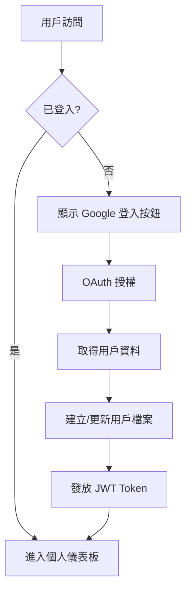
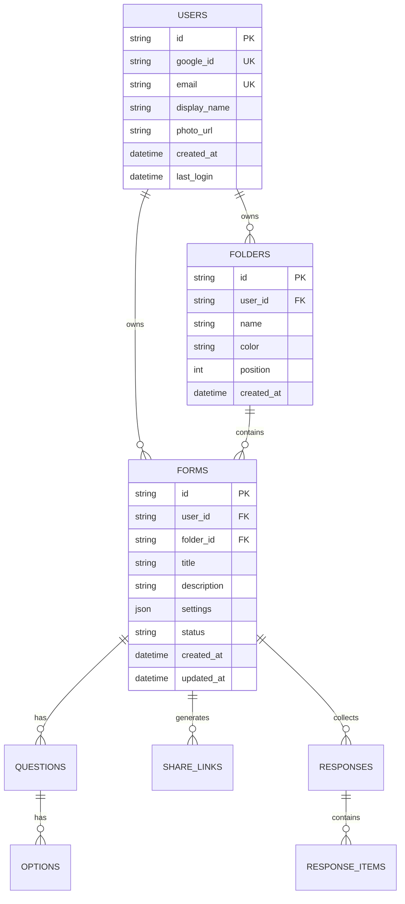

# 📋 Qter 智能問卷平台 - 產品需求文檔

## 🎯 產品願景
打造一個以 Google 登入為基礎的智能問卷平台，讓每個使用者都能輕鬆建立、管理和分享自己的問卷庫。

## 🔐 身份認證系統

### Google OAuth 2.0 登入
- **主要認證方式**：使用 Google 帳號快速登入
- **實作技術**：
  - Firebase Auth 或 Google Identity Services
  - JWT Token 管理
  - Refresh Token 自動更新
- **使用者資料**：
  - Google ID
  - 顯示名稱
  - 個人頭像
  - Email 地址

### 認證流程


## 📚 個人問卷庫系統

### 核心功能
1. **問卷管理**
   - 建立新問卷
   - 編輯現有問卷
   - 複製問卷模板
   - 刪除問卷
   - 問卷分類與標籤

2. **問卷分享**
   - 生成唯一分享連結
   - QR Code 自動生成
   - 設定有效期限
   - 限制回覆數量
   - 追蹤來源渠道

3. **數據分析**
   - 即時回覆統計
   - 圖表視覺化
   - CSV/Excel 匯出
   - 交叉分析報表

### 資料庫架構



## 🚀 實施計劃

### 第一階段：Google 登入整合 (2-3 天)
- [ ] 設定 Google Cloud Console 專案
- [ ] 整合 Google Identity Services
- [ ] 建立用戶資料表
- [ ] 實作 JWT 認證機制
- [ ] 前端登入 UI 組件

### 第二階段：問卷庫核心功能 (3-4 天)
- [ ] 用戶儀表板介面
- [ ] 問卷 CRUD 操作
- [ ] 資料夾分類系統
- [ ] 問卷模板功能

### 第三階段：分享與收集 (2-3 天)
- [ ] 短連結生成系統
- [ ] QR Code 生成
- [ ] 公開填寫頁面
- [ ] 回覆限制機制

### 第四階段：數據分析 (2-3 天)
- [ ] 基礎統計功能
- [ ] 圖表視覺化
- [ ] 匯出功能
- [ ] 即時更新機制

## 🛠️ 技術架構

### 前端技術
- **框架**：Vue 3 + TypeScript
- **認證**：Google Identity Services
- **狀態管理**：Pinia
- **UI 框架**：Tailwind CSS
- **圖表**：Chart.js / ECharts

### 後端架構
- **運行環境**：Cloudflare Workers
- **資料庫**：Cloudflare D1 (SQLite)
- **快取**：Cloudflare KV
- **認證**：JWT + Google OAuth
- **檔案儲存**：Cloudflare R2 (未來擴充)

### API 設計

```yaml
# 認證相關
POST   /api/auth/google    # Google OAuth 回調
POST   /api/auth/refresh   # 更新 Token
POST   /api/auth/logout    # 登出

# 問卷管理
GET    /api/forms          # 取得用戶所有問卷
POST   /api/forms          # 建立新問卷
GET    /api/forms/:id      # 取得單一問卷
PUT    /api/forms/:id      # 更新問卷
DELETE /api/forms/:id      # 刪除問卷
POST   /api/forms/:id/duplicate  # 複製問卷

# 資料夾管理
GET    /api/folders        # 取得所有資料夾
POST   /api/folders        # 建立資料夾
PUT    /api/folders/:id    # 更新資料夾
DELETE /api/folders/:id    # 刪除資料夾

# 分享連結
POST   /api/forms/:id/share      # 生成分享連結
GET    /api/shares/:hash          # 取得分享資訊
PUT    /api/shares/:hash          # 更新分享設定
DELETE /api/shares/:hash          # 停用分享

# 回覆收集
GET    /api/forms/:id/responses   # 取得回覆
POST   /api/public/s/:hash        # 提交回覆（公開）
GET    /api/forms/:id/analytics   # 取得分析數據
GET    /api/forms/:id/export      # 匯出數據
```

## 📊 使用者介面規劃

### 1. 登入頁面
- Google 登入按鈕（中央顯眼位置）
- 產品特色介紹
- 隱私權政策連結

### 2. 個人儀表板
- 左側：導航選單
  - 我的問卷
  - 資料夾分類
  - 數據分析
  - 帳號設定
- 中央：問卷列表（卡片式）
- 右上：用戶頭像與快速操作

### 3. 問卷編輯器
- 保留現有的所見即所得編輯器
- 新增自動儲存功能
- 版本歷史記錄

### 4. 分享管理
- 分享連結列表
- QR Code 下載
- 分享統計（點擊次數、填寫率）

## 🔒 安全性考量

### 資料保護
- HTTPS 全程加密
- XSS 防護（DOMPurify）
- CSRF Token 驗證
- SQL Injection 防護

### 隱私權
- GDPR 合規
- 資料最小化原則
- 用戶資料刪除權
- 透明的隱私政策

### 限流機制
- API 請求限流（60 req/min）
- 表單提交限流
- IP 黑名單機制

## 📈 成功指標

### 技術指標
- 頁面載入時間 < 2 秒
- API 響應時間 < 200ms
- 系統可用性 > 99.9%
- 並發處理 > 1000 用戶

### 業務指標
- 用戶註冊轉換率 > 30%
- 月活躍用戶增長 > 20%
- 問卷完成率 > 80%
- 用戶滿意度 > 4.5/5

## 🎯 MVP 範圍

### 包含功能
✅ Google 登入
✅ 個人問卷庫
✅ 問卷建立與編輯
✅ 分享連結生成
✅ 基礎數據統計
✅ CSV 匯出

### 暫不包含
❌ 團隊協作
❌ 付費方案
❌ 進階分析
❌ API 開放
❌ 多語言支援
❌ Email 通知

## 📝 開發優先順序

1. **P0 - 必須完成**
   - Google OAuth 登入
   - 用戶資料庫建立
   - 基礎問卷 CRUD
   - 分享連結功能

2. **P1 - 重要功能**
   - 資料夾分類
   - 基礎統計
   - CSV 匯出
   - QR Code 生成

3. **P2 - 優化項目**
   - 問卷模板
   - 進階統計圖表
   - 批量操作
   - 深色模式

## 🔄 下一步行動

1. 申請 Google Cloud Console 專案
2. 設定 OAuth 2.0 憑證
3. 初始化 Cloudflare Workers 專案
4. 建立 D1 資料庫 schema
5. 實作認證流程
6. 開發用戶儀表板

---

*最後更新：2025-09-28*
*版本：2.0 - Google 登入與個人問卷庫*